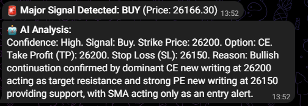

# 🤖 Google Gemini powered Nifty Option Bot

[](https://www.python.org/)
[](https://opensource.org/licenses/MIT)
[](#)

An automated Nifty 50 market analyzer that combines **Technical SMA Crossovers** with **Deep Option Chain Analysis** (OI, PCR, Max Pain) and **Google Gemini AI** to provide high-conviction trade setups.

---

## 🚀 Key Features

* **Dual-Signal Validation**: SMA (9/21) triggers act as alerts, which are then strictly validated by institutional Option Chain data.
* **Institutional Data Suite**: Calculates real-time **PCR (Put-Call Ratio)** and **Max Pain** strikes to identify price magnets.
* **AI Strategy Engine**: Uses **Gemini 2.0/2.5 Flash** to analyze "New Writing" (Change in OI) and identify institutional support/resistance walls.
* **Telegram Integration**: Real-time one-line actionable signals sent directly to your phone.

---

## 🛠️ Technical Stack

* **Core**: Python 3.11+
* **Broker API**: Upstox API (Option Chain, Greeks, Volume)
* **AI**: Google Gemini (via `google-genai`)
* **Data**: Yahoo Finance (Live Spot Price)
* **Resilience**: Tenacity (Exponential backoff for API stability)

---

## ⚙️ Configuration & Environment Variables

Create a `.env` file or set these in your deployment platform (Railway/Heroku):

| Variable | Requirement | Description |
| :--- | :--- | :--- |
| `UPSTOX_ACCESS_TOKEN` | Required | Your Upstox developer access token. |
| `GEMINI_API_KEY` | Required | Google AI Studio API key. |
| `TELEGRAM_BOT_TOKEN` | Required | Token from Telegram's @BotFather. |
| `TELEGRAM_CHAT_ID` | Required | Your Telegram chat/group ID. |
| `SMA_BUFFER` | Optional | Points buffer for crossover (Default: 3.0). |
| `STRIKES_TO_FETCH` | Optional | Number of ATM strikes to scan (Default: 10). |

---

## 📖 Trading Logic

1.  **The Alert**: Bot monitors Nifty 50. If SMA9 crosses SMA21 (with buffer), it triggers a data fetch.
2.  **The Analysis**: Bot retrieves the closest expiry option chain, PCR, and Max Pain.
3.  **The Filter**: AI evaluates if the trend is confirmed by **New Writing** (Change in OI).
    * *Bullish*: SMA Buy + High PE Writing + PCR > 1.0.
    * *Bearish*: SMA Sell + High CE Writing + PCR < 0.7.
4.  **The Recommendation**: If validated, a signal is sent in the following format:
    > `Confidence: High. Signal: Buy. Strike Price: 25000. Option: CE. Take Profit (TP): 25150. Stop Loss (SL): 24900. Reason: SMA confirms signal, PCR 1.12 supports rally, and new PE writing at 25000 confirms conviction.`

    
---

## 📦 Installation & Deployment

### Local Setup
```bash
# Clone the repo
git clone [https://github.com/vishnuar/nifty_sma_bot.git](https://github.com/vishnuar/nifty_sma_bot.git)
cd nifty_sma_bot

# Install dependencies
pip install -r requirements.txt

# Run the bot
python main.py
```
---

## 🛠️ Credits & Acknowledgements

Big Thanks to **Google Gemini** and without you can't make it this script

---

## ⚠️ Disclaimer

This software is for **Please trade wisely and this tool make mistakes**...